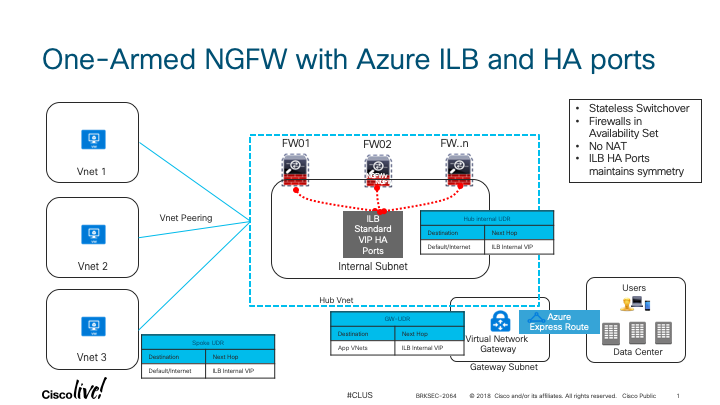

## NGFWv in Azure One-Armed Design using Azure ILB and HA Ports

### Design



### Azure Configuration Steps
- Create resource group  
- Create availability set  
- Create VNet  
- Create subnets  
    - mgmt
    - diag
    - external
    - internal
- Deploy NGFW ARM template  
    
- Create Standard ILB
    - Place front-end IP in internal subnet with a static address (VNet UDRs will point to this address)
    - Health probe to SSH TCP/22
    - Place NGFWs in back-end pool
    - Configure load balancing rule with HA ports enabled

### FMC Configuration
- SSH to NGFW and enable FMC management; accept all the defaults
```
configure manager add DONTRESOLVE cisco123 5
```
- Add devices to FMC
- Edit interface configurations; save and deploy
- Add default route for internal interface that points ILB front-end IP (subnet default gw?); save and deploy
- Enable SSH from Azure ILB probing address (168.63.129.16)
- Check health probe status of Azure ILB

### Create Spoke VNets and Attach to Hub
- Create VNet and Subnets
- Create VNet peering both the hub and spoke VNet
    - Enable virtual network access and forwarded traffic on both sides
- Create UDR
    - Add default route of type virtual appliance that points to ILB front-end IP
    - Associate UDR to spoke VNet subnets

### From Connectivity to On-prem, Create Gateway Subnet and Attach Gateways

### External internet; All activities in FMC
- Configure and enable external interface.
- Add default route to external subnet default gateway.
- Change route to internal interface to be more specific for E/W and on-prem traffic (10/8 for instance)
- Configure NAT configuration
    - Threat defense type
    - Dynamic
    - Source interface is internal, destination interface is exernal
    - Original source is 10/8, translated source is interface
- Save and deploy changes
- In Azure portal, create standard sku public IP and associate it to the external interface (nic2)
- Either define NSG undefined (all traffic permitted) or create an NSG for external interface.
- Test with endpoints and observers events and 'show xlate'

### Ingress from internet
- For ingress traffic (from internet to azure app), you need to add an exernal load balancer and configure the NGFWs external interfaces as backend pools.
- NGFW will need to SNAT the sessions so that responses from the application will flow to right NGFW to maintain symmetry.

### References

<https://clnv.s3.amazonaws.com/2019/anz/pdf/BRKSEC-2064.pdf>  
<https://www.youtube.com/watch?v=sNhjggrOzew&feature=youtu.be>  
<https://www.youtube.com/watch?v=Zjc9hmc2m68>  